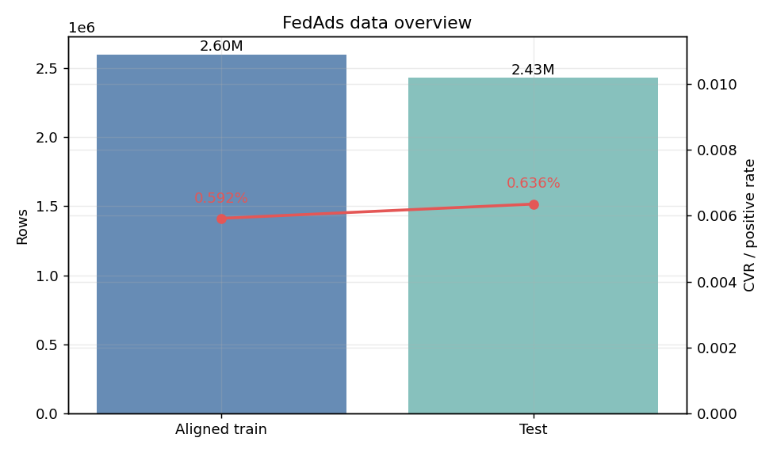
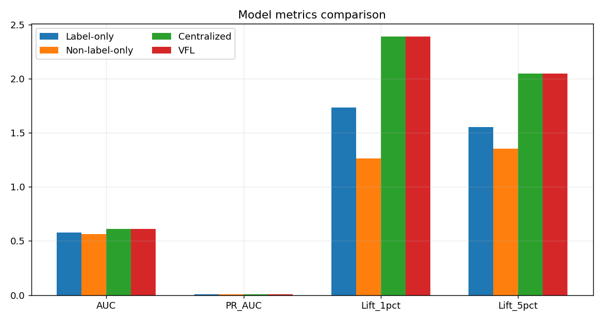
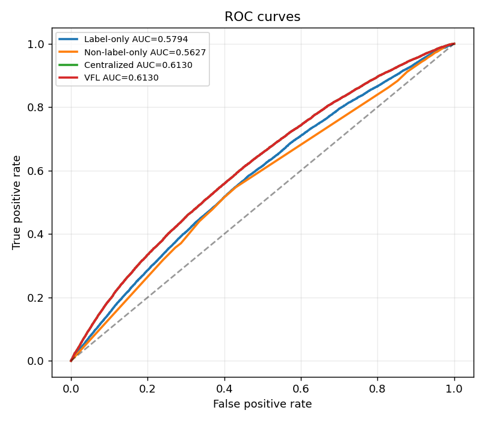
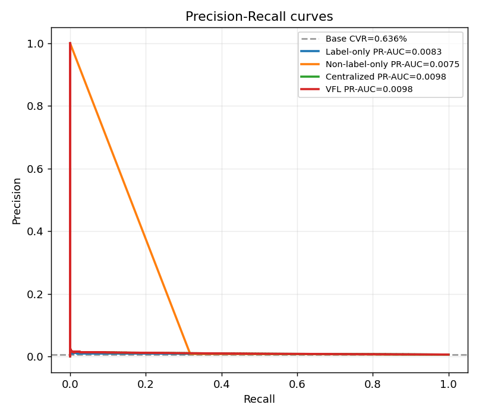
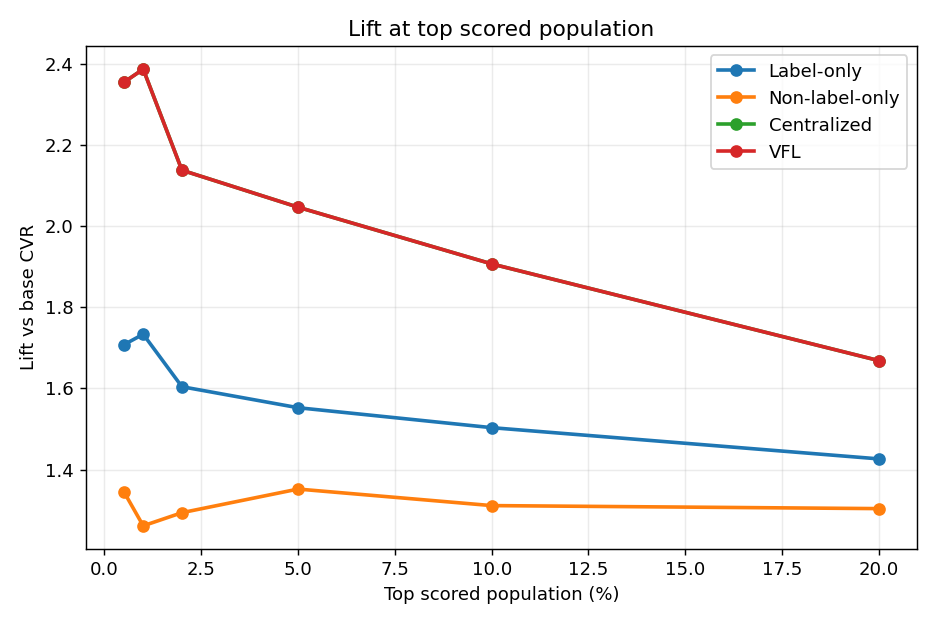
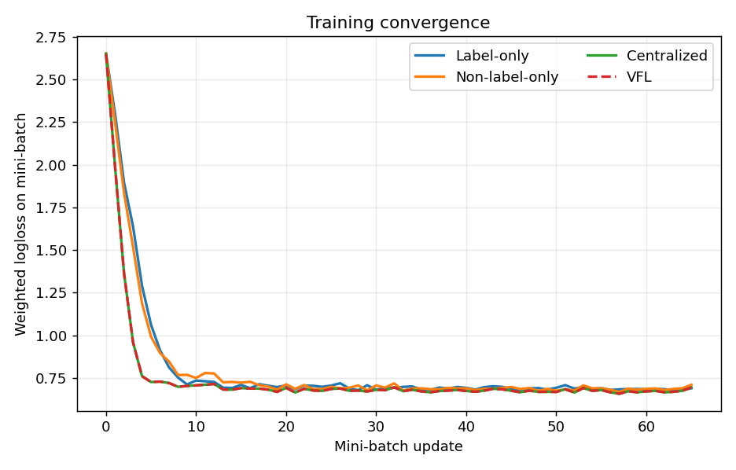
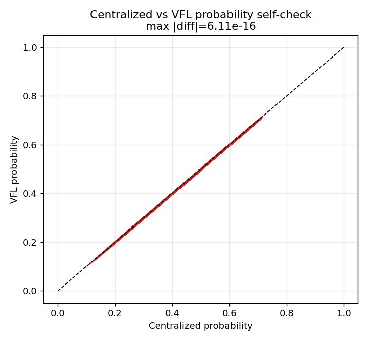
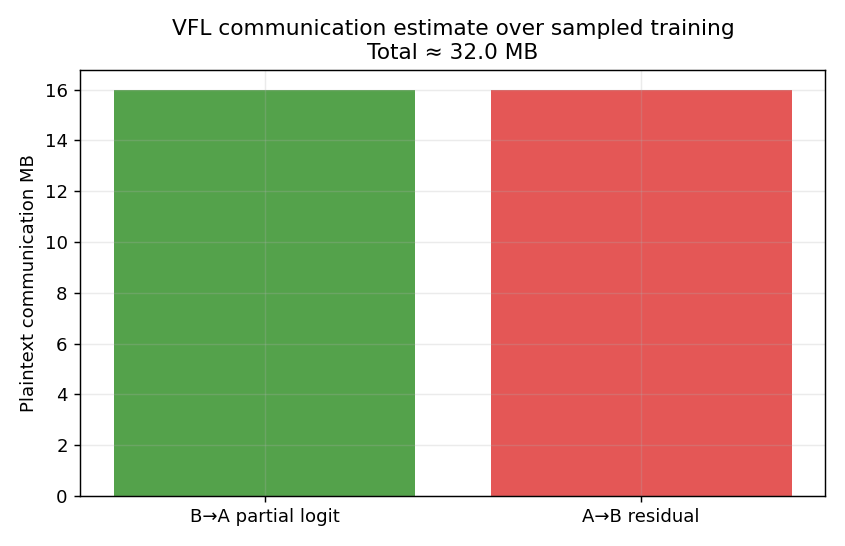

# FedAds 纵向联邦学习初步可行性验证报告

**实验编号：** `fedads_initial_v2`  
**数据来源：** 阿里妈妈 FedAds / 天池数据集  
**实验定位：** 原生 VFL 广告转化预估 benchmark 的初步可行性验证，不作为金融风控主结果。

## 1. 核心结论

- 本次在 aligned train + test 上完成 Label-only、Non-label-only、Centralized、VFL 四模型闭环。
- 测试样本 `2,432,490` 行，正样本率 `0.636%`。
- VFL AUC 为 `0.612967`，Label-only AUC 为 `0.579407`，AUC 增益 `+0.033561`。
- VFL PR-AUC 为 `0.009761`，Label-only PR-AUC 为 `0.008294`，PR-AUC 增益 `+0.001466`。
- Centralized 与 VFL 最大预测概率差 `6.106e-16`，说明线性 VFL 拆分实现与集中式同口径一致。

## 2. 数据概览

| 数据 | 行数 | 正样本 | 正样本率 | 文件大小 |
|---|---:|---:|---:|---:|
| aligned train | 2,598,552 | 15,391 | 0.592% | 1.45 GB |
| test | 2,432,490 | 15,460 | 0.636% | 1.36 GB |

## 3. 处理流程

1. 只读读取 `sample_train_aligned.csv` 与 `test.csv`，暂不使用 `sample_train_unaligned.csv`。
2. 按官方字段归属拆分 label party 特征与 non-label party 特征。
3. 将所有离散 ID 字段转为 `field=value` token，并使用 FeatureHasher 生成高维稀疏矩阵。
4. 使用 mini-batch 逻辑回归训练单方模型与两方 VFL 线性模型。
5. 以 AUC、PR-AUC、Logloss、Lift@TopK 和 Capture@TopK 评估测试集排序效果。

## 4. 模型指标

| model          |      AUC |   PR_AUC |   Logloss |   Lift_1pct |   Lift_5pct |   Lift_10pct |   Capture_1pct |   Capture_5pct |   Capture_10pct |
|:---------------|---------:|---------:|----------:|------------:|------------:|-------------:|---------------:|---------------:|----------------:|
| Label-only     | 0.579407 | 0.008294 |  0.679909 |    1.733499 |    1.552387 |     1.503234 |       0.017335 |       0.077620 |        0.150323 |
| Non-label-only | 0.562724 | 0.007549 |  0.689193 |    1.261314 |    1.351870 |     1.311125 |       0.012613 |       0.067594 |        0.131113 |
| Centralized    | 0.612967 | 0.009761 |  0.670920 |    2.386795 |    2.046563 |     1.906856 |       0.023868 |       0.102329 |        0.190686 |
| VFL            | 0.612967 | 0.009761 |  0.670920 |    2.386795 |    2.046563 |     1.906856 |       0.023868 |       0.102329 |        0.190686 |

## 5. 联邦拆分自检与通信估算

本版实验中，Centralized 与 VFL 已经走不同实现路径：

- Centralized：`independent sparse.hstack([XA, XB]) + update_binary`
- VFL：`two-party split update with XA @ wA + XB @ wB`

- `max_weight_A_diff`: `2.220e-16`
- `max_weight_B_diff`: `6.661e-16`
- `bias_diff`: `1.776e-15`
- `max_probability_diff`: `6.106e-16`
- 抽样训练过程明文中间量通信估算约 `31.98` MB。

因此，两者接近不是因为原始数据泄漏或直接共享，而是因为线性逻辑回归下 `XA·wA + XB·wB` 与集中式 `[XA|XB]·w` 在数学上等价。

## 6. 数据泄漏审计

- 特征列表是否包含 `sample_id` / `label`：`False`。
- 训练集与测试集 `sample_id` 交集：`0`。
- 单字段 target-encoding 探针最高 AUC：`0.576586`。
- 审计风险等级：`low`。
- aligned train 内部重复 sample_id 行数：`83,263`；test 内部重复 sample_id 行数：`1,523`。这些重复不构成训练测试泄漏，因为 train/test 交集为 0。

详细审计文件：`../processed/leakage_audit.json`。

## 7. 边界说明

- 本实验是初步可行性验证，使用的是线性 VFL，不是 FedAds 论文中的神经网络或半监督增强模型。
- FedAds 是广告 CVR / 客户转化识别场景，不应被直接表述为 HSBC 金融风控业务效果。
- 如果需要进一步拉开效果差距，下一阶段应引入 `sample_train_unaligned.csv`、embedding + MLP 或 FedAds 论文中的未对齐样本增强思路。
