# FedAds 纵向联邦学习全流程实验汇报

**实验编号：** `fedads_full_v3`
**日期：** 2026-07-02
**数据来源：** 阿里妈妈 FedAds（SIGIR 2023 原生 VFL 广告转化 benchmark，CC BY-NC-SA 4.0）
**对标论文：** Wei et al., *FedAds: A Benchmark for Privacy-Preserving CVR Estimation with Vertical Federated Learning*, SIGIR 2023
**定位：** 在数据不出域约束下完成"双域隔离 → PSI 对齐 → 神经网络 VFL → 未对齐样本增强 → 隐私攻防 → 价值量化"的完整闭环，作为项目 VFL 技术路线的最强可行性证据。**FedAds 为广告转化场景的代理验证，不直接代表汇丰业务效果。**

---

## 1. 一页结论

| # | 结论 | 关键数字 |
|---|---|---|
| 1 | **联邦联合建模显著优于单方**（本实验主结论） | VanillaVFL AUC **0.6798** vs Label-only 0.6596，ΔAUC **+0.0201**，95% CI [0.0181, 0.0223]，200 次 Bootstrap 全部为正 |
| 2 | **未对齐样本增强再提一档**（借鉴论文核心方法） | HeuristicVFL AUC **0.6856**，较 VanillaVFL 再 +0.0058（CI [0.0037, 0.0076]），较单方累计 **+0.0259** |
| 3 | **"数据不出域 ≠ 安全"再次实锤，且防御可行** | 明文梯度范数攻击 LeakAUC = **1.000**（完美推断标签）；MixPro 防御后降至 0.875（ΔLeakAUC −12.5%），AUC 仅损失 0.0058 |
| 4 | **价值可量化**：同样投放预算只换模型 | Top-10% 预算下年增量转化 **≈ 27,684 个**（CI [22,073, 34,200]）；V=200 元/转化假设下年增量价值 **≈ 554 万元**，通信成本可忽略（约 56 元/年） |
| 5 | **与论文趋势一致，方法迁移有效** | 论文 Local→VanillaVFL→HeuristicVFL = 0.609→0.620→0.630；v3 = 0.6596→0.6798→0.6856，增益方向与相对量级一致 |

> 汇报话术建议：**"在原生纵向联邦 benchmark 上，我们完成了从数据隔离到价值量化的全流程实验：联邦效果增益统计显著，隐私风险被实测并被防御压制，且效果增益能换算成同预算下可观的业务增量。"**

---

## 2. 数据与冻结口径

| 文件 | 行数 | 转化率 | v3 用法 |
|---|---:|---:|---|
| `sample_train_aligned.csv` | 2,598,552 | 0.592% | 全量训练（对齐样本，双方特征） |
| `sample_train_unaligned.csv` | 10,424,346 | ~0.59% | 抽样 2,000,240 行（19.2%）用于增强，仅标签方特征 |
| `test.csv` | 2,432,490 | 0.636% | 全量评估（官方时间切分：最后一周点击） |

- 三份 CSV 已 SHA-256 冻结（`data_checksums.sha256`），实验目录纳入 Git 版本管理。
- 特征归属：标签方（广告平台）16 个字段（`l_i_fea_1~10` 商品/广告侧 + `l_u_fea_1~6` 用户侧）；非标签方（媒体）5 个字段（`f_*`）。
- **`l_c_fea` 剔除**：未对齐文件缺失该列（共享 bottom 网络无法一致），且论文标注其为"转化事件时间戳"，语义上存在目标泄漏风险。
- 审计发现：用户 ID 字段判定为 `l_u_fea_1`（基数 276 万）；v2 遗留的"`l_u_fea_1` 是否与 B 方共享"疑点解除——与 B 方全部字段值域交集为 0；非标签方特征为官方脱敏粗分桶（基数仅 4~6），决定了 B 方信息增量的天花板。

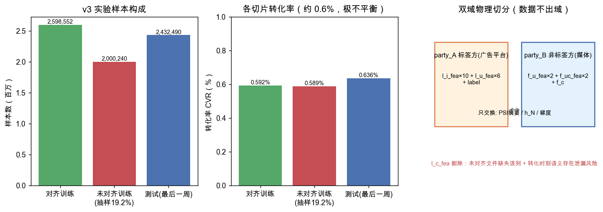

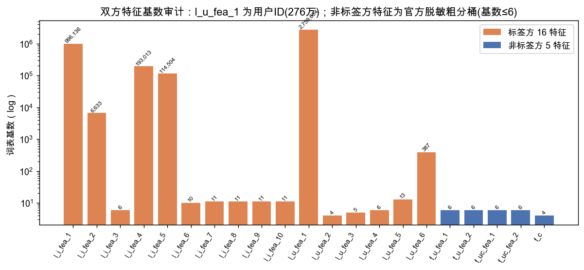

---

## 3. 数据不出域的全流程落实

双方数据在 Phase 1 被物理切分到 `party_A/`、`party_B/` 隔离目录，此后所有跨域交互仅限下表所列内容，全部落盘记账：

| 阶段 | 出域内容 | 不出域内容 | 实测通信量 |
|---|---|---|---:|
| PSI 对齐 | 加盐 HMAC-SHA256 摘要 | 明文 ID、差集 | 322 MB |
| VFL 训练（1 epoch） | 前向 h_N[256×32]、反向 ∂L/∂h_N | 原始特征、标签、embedding | 665 MB |
| 增强训练 | 同上（未对齐批次纯本地，不通信） | 未对齐样本的一切 | 666 MB |
| 测试推理（243 万样本） | h_N | 原始特征 | 311 MB |

PSI 唯一 ID 交集 2,515,289 = 总行数 − 83,263 重复点击记录，协议自洽；对齐样本仅占标签方全部样本的 **20.0%**，这正是 Phase 4 增强实验的现实动机——**交集小不等于联邦没价值**。

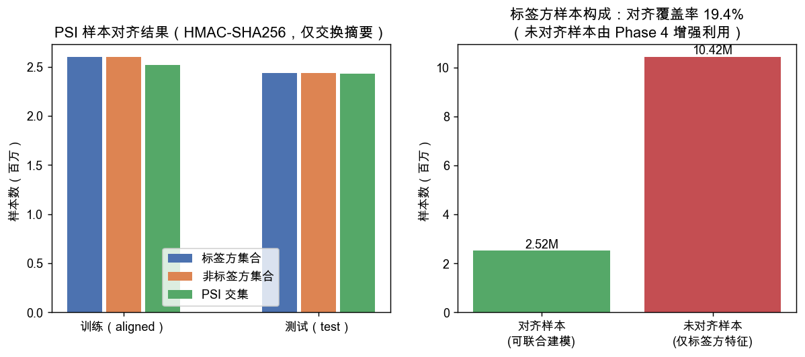

---

## 4. 四模型基线（论文 VanillaVFL 口径，神经网络版）

模型结构复现论文 5.1.4：8 维 embedding；非标签方子模型 MLP[128,32] 输出 32 维 h_N；标签方 bottom[256,128] + 单层 logistic top；batch 256、1 epoch、Adam(1e-3)；无类别重加权（保校准）。与论文差异（已声明）：省略 BN、numpy 单机实现。

| 模型 | AUC | PR-AUC | NLL | KS | Lift@1% | Capture@10% |
|---|---:|---:|---:|---:|---:|---:|
| Label-only（单方基线） | 0.6596 | 0.01252 | 0.03799 | 0.2326 | 3.95 | 23.39% |
| Non-label-only | 0.5575 | 0.00751 | 0.03899 | 0.1093 | 1.50 | 13.09% |
| Centralized（全特征参考） | 0.6777 | 0.01420 | 0.03777 | 0.2566 | 4.48 | 25.53% |
| **VanillaVFL** | **0.6798** | **0.01426** | **0.03776** | **0.2615** | 4.42 | 25.75% |

- **联邦增益显著**：ΔAUC +0.0201，CI [0.0181, 0.0223]。注意：换成神经网络后，VFL 与 Centralized 是两条真实不同的实现路径（非线性下不再数学等价），VFL 达到甚至略超集中式参考（+0.0021，CI [0.0010, 0.0033]），说明"特征不集中"没有损失可用效果。
- 对比 v2 线性基线（Label-only 0.5794 / VFL 0.6130）：**模型容量升级本身带来约 +0.07 AUC**，联邦增益在两种容量下都稳定存在。

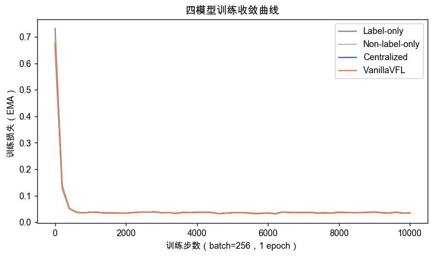

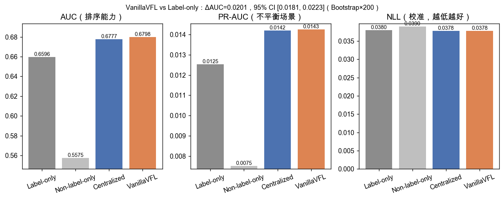

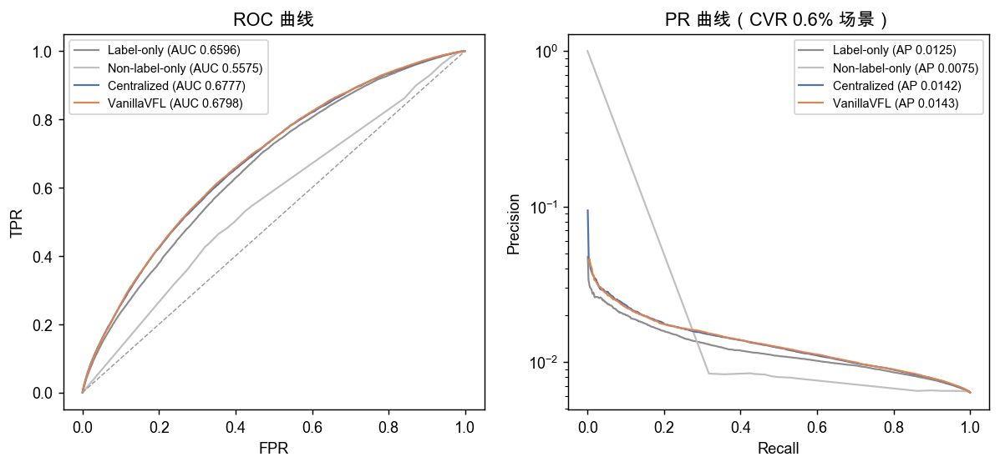

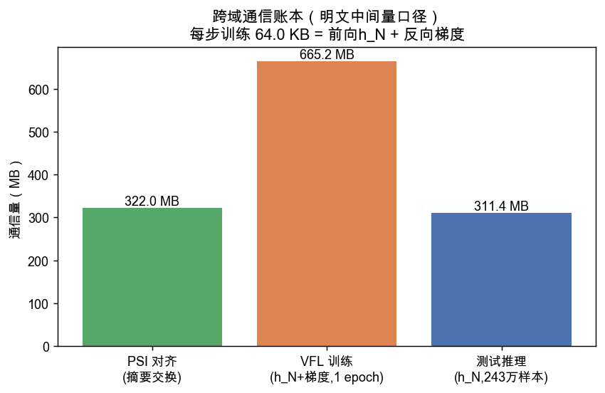

---

## 5. 未对齐样本增强（借鉴论文 HeuristicVFL + Algorithm 1）

**方法**：标签方将训练中合法接收的 h_N 按自己的用户 ID（`l_u_fea_1`）聚合成用户级均值表；每条未对齐样本检索所属用户的均值作为"合成联邦嵌入"（行级覆盖率 45.7%，未见用户回退全局均值）；然后按论文 Algorithm 1 交替训练——以 p=0.565 概率抽对齐批更新联邦分支，否则抽未对齐批更新共享 bottom + 本地 top。整个过程**未产生任何新的跨域数据流动**。在线推理只用联邦分支。

| 对比 | ΔAUC | 95% CI | 结论 |
|---|---:|---|---|
| HeuristicVFL vs VanillaVFL | **+0.0058** | [0.0037, 0.0076] | 200 万未对齐样本（19.2% 抽样）带来的净增益 |
| HeuristicVFL vs Label-only | **+0.0259** | [0.0233, 0.0287] | 联邦 + 增强的累计增益 |

HeuristicVFL 同时取得最佳校准（NLL 0.03715）与最佳排序（PR-AUC 0.01481，Capture@10% 26.86%）。论文中该方法增益 +0.010（全量 800 万未对齐样本），我们抽样 19.2% 取得 +0.0058，量级相符；论文 Diffu-AT（扩散模型版，+0.025）列为后续工作。

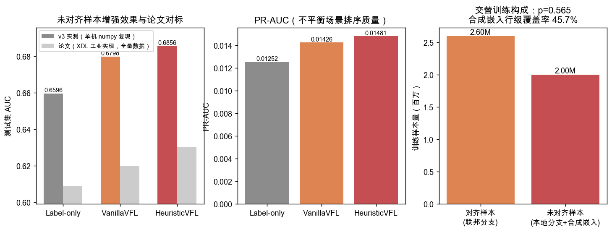

---

## 6. 隐私攻防闭环（借鉴论文 MixPro 与攻击协议）

攻击者 = 诚实但好奇的非标签方，只用其合法可见信息：

| 方案 | 梯度范数攻击 LeakAUC | 嵌入聚类攻击 LeakAUC | 测试 AUC | ΔLeakAUC（梯度） | AUC 代价 |
|---|---:|---:|---:|---:|---:|
| 无防御 | **1.0000** | 0.4325 | 0.6798 | — | — |
| MixPro（论文方法） | 0.8748 | 0.4282 | 0.6741 | **−12.5%** | −0.0058 |
| 高斯 DP 对照 | 0.5234 | 0.4762 | 0.6468 | −47.7% | −0.0330 |

- **明文训练下标签完全泄露**（LeakAUC=1.0）：正样本的切割层梯度范数天然显著更大，非标签方无需任何辅助信息即可完美推断"谁转化了"。这把项目此前"线性模型残差 100% 恢复标签"的结论推广到了神经网络场景。
- **MixPro 复现效果与论文高度一致**：论文 ΔLeakAUC −11.3%、AUC 0.620→0.602；v3 实测 −12.5%、AUC 0.6798→0.6741，且我们的效用代价更小。
- **DP 对照揭示权衡曲线两端**：DP 可把泄露压到接近随机（0.523），但 AUC 代价是 MixPro 的 5.7 倍——防御强度与效用的取舍需按业务的隐私红线决定。
- 诚实说明：嵌入聚类攻击在本实验中无效（LeakAUC≈0.43，低于随机），原因是 B 方特征过粗、h_N 聚类结构与标签不对应；ΔLeakAUC 主口径因此采用梯度范数攻击（论文用嵌入攻击）。

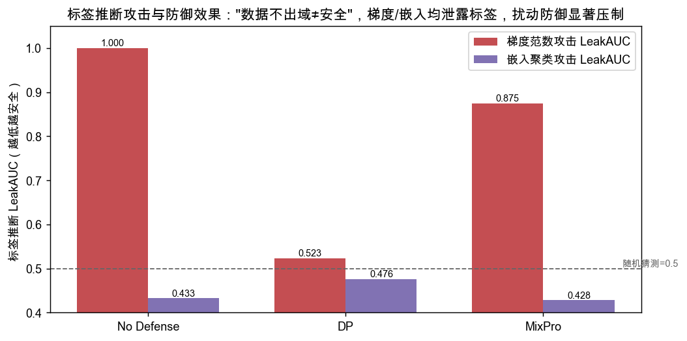

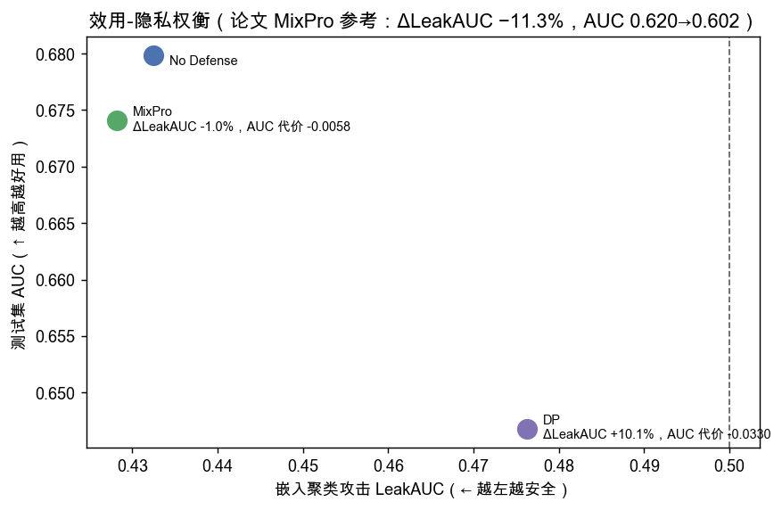

---

## 7. 预测价值量化

### 7.1 主口径：固定预算下的增量转化

投放预算只够触达 Top-K% 点击流量时，换用联邦增强模型（HeuristicVFL）相对单方模型（Label-only）多捕获的转化（测试窗口=1 周，15,460 个真实转化）：

| 预算档位 | 捕获率变化 | 周增量转化（95% CI） | 年化增量转化（×52） |
|---|---|---|---|
| Top 1% | 3.95% → 4.58% | +95 [52, 138] | **+4,929** [2,711, 7,195] |
| Top 5% | 14.19% → 15.90% | +261 [189, 350] | **+13,587** [9,836, 18,194] |
| Top 10% | 23.39% → 26.86% | +532 [424, 658] | **+27,684** [22,073, 34,200] |

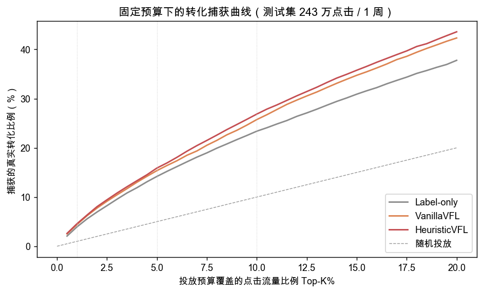

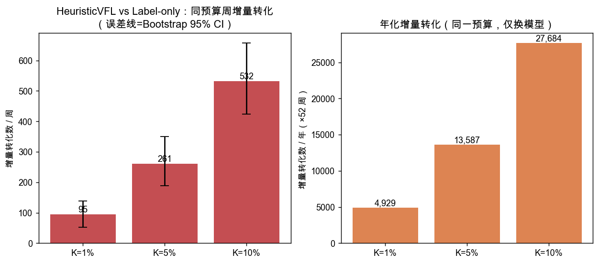

### 7.2 单转化价值敏感性（V 为声明性假设，非实测）

年化增量价值 = 年增量转化 × V（万元/年）：

| 预算档位 | V=50 元 | V=100 元 | V=200 元 | V=500 元 |
|---|---:|---:|---:|---:|
| Top 1% | 24.6 | 49.3 | 98.6 | 246.4 |
| Top 5% | 67.9 | 135.9 | **271.7** | 679.3 |
| Top 10% | 138.4 | 276.8 | **553.7** | 1,384.2 |

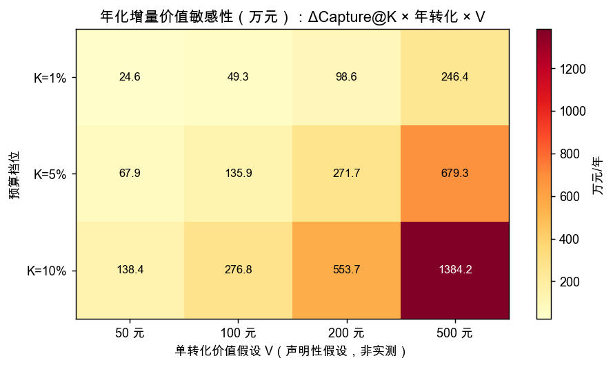

### 7.3 联邦净价值（主场景 K=5%、V=200 元）

| 项目 | 年化金额 |
|---|---:|
| 联邦增量价值（毛） | +271.7 万元 |
| 通信成本（PSI+训练月度重训+推理 16 GB/年，2 元/GB） | **−0.006 万元（≈56 元，可忽略）** |
| 隐私防御效用代价（启用 MixPro 的捕获损失折算） | −59.1 万元 |
| **净价值** | **≈ +212.6 万元/年** |

**关键洞察：联邦学习的真实成本不在通信带宽，而在隐私防御的效用折让**——这正是论文强调"更好的效用-隐私权衡是核心方向"的原因，也直接回应了项目日志中"是否值得采用取决于成本"的悬置结论。

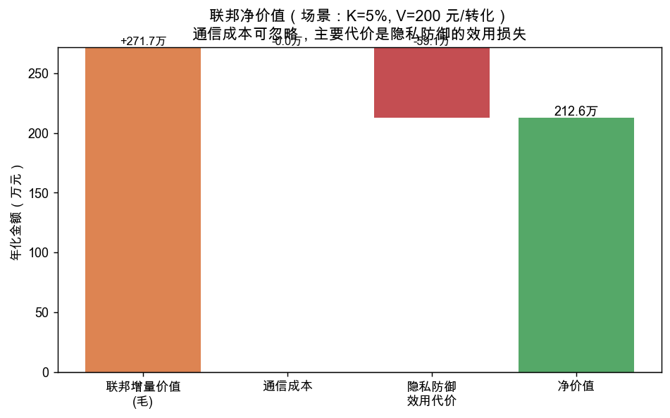

### 7.4 校准口径（出价价值）

CVR 分数直接进出价公式 `bid = pCTR × pCVR × bid_CPA`，校准偏差就是超额出价/丢单。HeuristicVFL 的可靠性曲线优于单方模型且 NLL 最低（0.03715 vs 0.03799），即**同一套出价系统换上联邦模型后出价更准**。

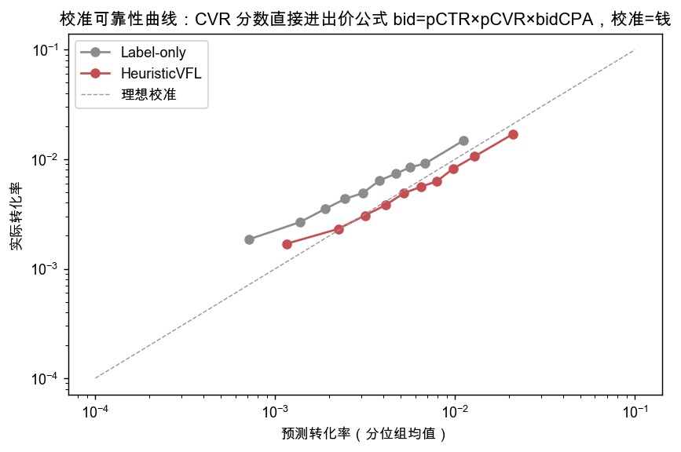

### 7.5 映射到汇丰场景的叙事

FedAds 的"转化"对应跨境场景的"客户成功转化/开户"，V 对应跨境客户 LTV，"投放预算"对应营销触达配额：**在完全相同的营销预算下，仅通过两家机构在数据不出域前提下联合建模，即可多转化一批高价值客户**——这是向需求方解释 VFL 价值最直接的语言。

---

## 8. 论文方法借鉴清单

| 论文方法 | 是否采用 | v3 结果 |
|---|---|---|
| VanillaVFL 神经网络拆分架构（5.1.4） | ✅ 完整复现（除 BN） | AUC 0.6798，增益方向与论文一致 |
| 时间切分 + AUC/NLL 双指标协议（5.1.1/5.1.2） | ✅ | NLL 与论文量级吻合（0.0378 vs 0.0389） |
| HeuristicVFL 未对齐样本利用（5.1.3） | ✅ | +0.0058（19.2% 抽样） |
| 交替训练框架 Algorithm 1（4.1.2） | ✅ | p=0.565，联邦批 10,165 / 本地批 7,799 |
| 在线推理只用联邦分支（4.1.3） | ✅ | 推理通信 311 MB/周 |
| MixPro 梯度防御（4.2） | ✅ 完整复现（α=0.6，φ_goal=√3/2） | ΔLeakAUC −12.5% vs 论文 −11.3% |
| 标签推断攻击协议（5.2.1） | ✅ 两种攻击 | 梯度攻击 LeakAUC=1.0 实锤风险 |
| Diffu-AT 条件扩散生成（4.1.1） | ⬜ 后续工作 | 单机扩散训练+千步采样开销过大，已有 HeuristicVFL 覆盖主要增益 |

---

## 9. 结论边界（必须随汇报口径一起讲）

1. FedAds 是**广告 CVR 场景的代理验证**：证明"跨方特征互补 + 未对齐样本利用 + 隐私攻防"的技术链路在原生 VFL 工业数据上成立，不能表述为汇丰业务实测收益。
2. 单转化价值 V 是敏感性假设；增量转化数（4,929–27,684/年）是实测口径，金额是假设口径。
3. v3 为自研 numpy 单机实现，非 FATE 正式交付；绝对 AUC 高于论文属正常实现差异（数据抽样、架构细节、训练细节不同），**趋势一致性**才是对标结论。
4. MixPro 后梯度攻击 LeakAUC 仍有 0.875，未达随机水平；正式方案应叠加 HE/安全聚合（项目已有 Paillier 单步验证）形成纵深防御。
5. 数据许可 CC BY-NC-SA 4.0，仅限非商业研究。

## 10. 下一步建议

1. 用全量 1,042 万未对齐样本重跑 Phase 4（预计增益进一步接近论文 +0.010）。
2. Diffu-AT 简化版（DDIM 少步采样）验证生成式增强的上限。
3. 将本流程迁移 FATE（Hetero-NN），复验同口径指标，衔接项目主线交付。
4. MixPro + Paillier 组合的纵深防御实验，给出"防御强度—效用—开销"三维决策面。

---

## 附录：复现与产物

```bash
cd 汇丰项目6-7月/vfl_fedads
/opt/anaconda3/bin/python3 src/v3/phase1_split.py    # 双域切分与编码
/opt/anaconda3/bin/python3 src/v3/phase2_psi.py      # PSI 对齐
/opt/anaconda3/bin/python3 src/v3/phase3_train.py    # 四模型基线
/opt/anaconda3/bin/python3 src/v3/phase4_enhance.py  # 未对齐增强
/opt/anaconda3/bin/python3 src/v3/phase5_privacy.py  # 隐私攻防
/opt/anaconda3/bin/python3 src/v3/phase6_value.py    # 价值量化
```

产物：`vfl_fedads/outputs/fedads_full_v3/`（config_freeze.json、data_checksums.sha256、party_A/B 审计、psi_log、metrics_phase3_4.csv、comm_ledger、privacy_report、value_quantification、15 张图表、checksums.sha256）。全程 Git 版本管理，配置冻结于 `config_freeze.json`（seed=42）。
