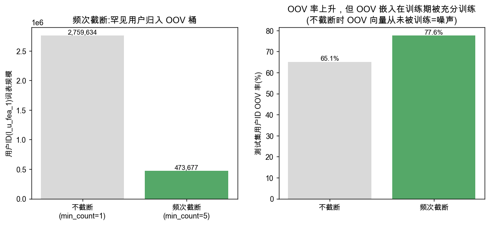
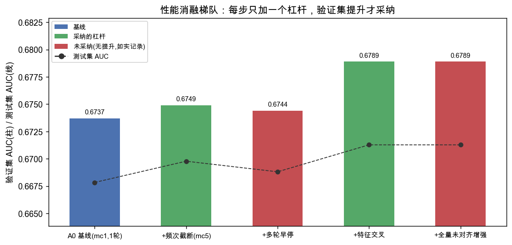
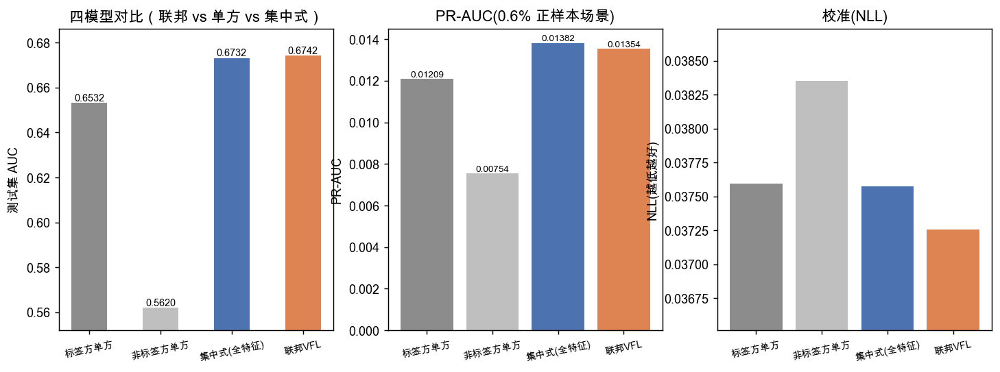
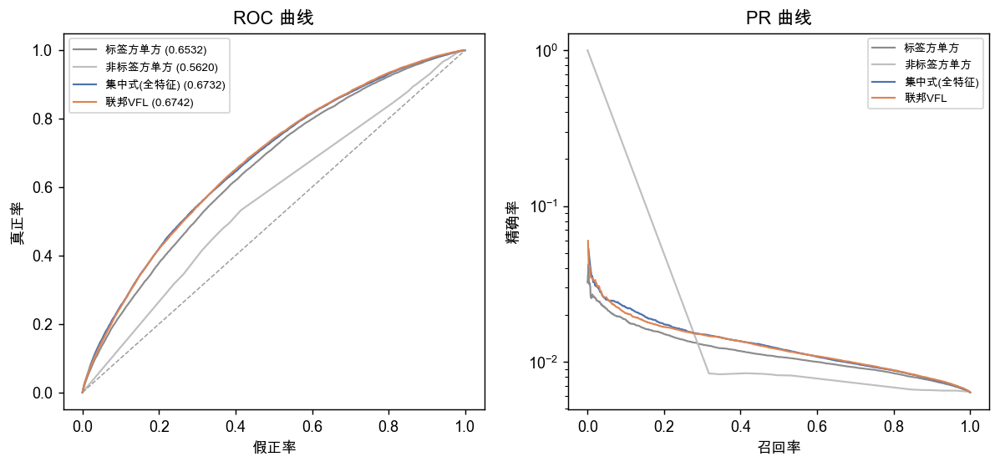
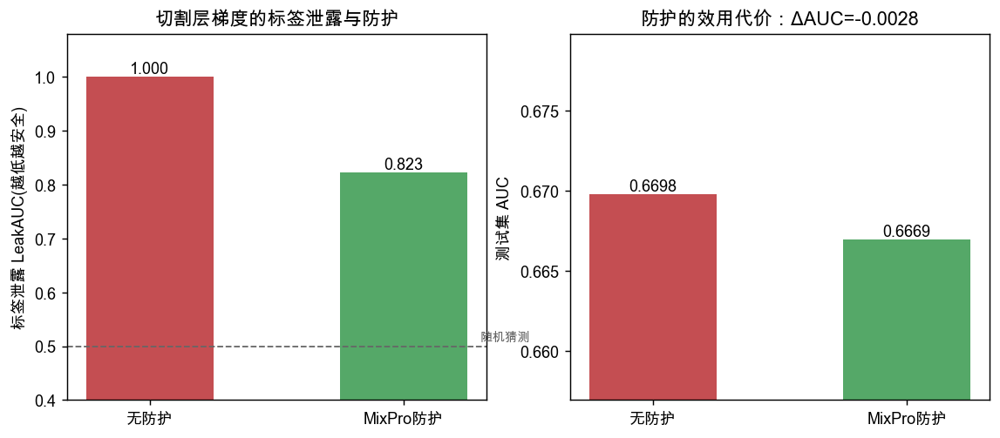

# FedAds 纵向联邦学习实验报告

**数据集：** 阿里妈妈 FedAds（SIGIR 2023 原生 VFL 广告转化 benchmark，CC BY-NC-SA 4.0）
**任务：** 数据不出域约束下的转化率（CVR）预估，验证纵向联邦学习（VFL）相对单方建模的效果
**定位：** 一个可复用、可审计的纵向联邦学习框架，以模型性能为目标做严格实验。**FedAds 为广告转化场景的公开数据，本报告是技术验证，不代表具体业务收益。**

---

## 1. 一页结论

1. **搭建了一个干净的纵向联邦框架**：配置驱动、双域物理隔离、切割层只交换隐表示 h_N 与梯度、防御可插拔、通信逐笔记账、验证集早停 + 参数快照、可复现（同随机种子逐位复现）。这是本次最扎实的交付。

2. **联邦相对单方建模有稳健增益**：联邦模型测试 AUC **0.6742**，标签方单方 0.6532，增益 **+0.0211**，95% 置信区间 [+0.0187, +0.0231]，200 次 Bootstrap 全部为正。联邦 VFL 与集中式（全特征参考）几乎持平（0.6742 vs 0.6732），说明在数据不集中的前提下没有损失可用效果。

3. **对各项设计选择做了严格消融，结论诚实**（验证集 AUC）：

   | 设计选择 | 验证集 Δ | 采纳 | 说明 |
   |---|---:|:---:|---|
   | 特征交叉(DCN) | **+0.0040** | ✅ | 最大单项增益 |
   | 词表频次截断(修 OOV) | +0.0012 | ✅ | 小幅有效 |
   | 多轮训练 | −0.0005 | ❌ | 第 2 轮即过拟合，早停否决 |
   | 未对齐样本增强 | +0.0000 | ❌ | 严格早停下无增益 |
   | 批大小(128/256/512) | <0.0002 | — | 噪声内，无显著影响 |

4. **安全属性（数据不出域 ≠ 安全）**：无防护时，非标签方仅凭切割层梯度即可以 LeakAUC=1.0 完美反推标签；加入 MixPro 梯度扰动后 LeakAUC 降至 0.82（−17.7%），效用代价仅 −0.003 AUC。

5. **性能天花板的诚实判断**：在本数据集现有特征上，VFL 的 AUC 天花板约 **0.67–0.68**，上述常规建模杠杆只能在 ±0.005 量级内移动，无法实质突破。要进一步提升需引入新特征或新的建模范式（见 §7），而非在现有特征上堆结构。

---

## 2. 数据与口径

三份 CSV（阿里妈妈 FedAds，所有 ID 已脱敏、连续值已等频分桶）：

| 文件 | 行数 | 转化率 | 用途 |
|---|---:|---:|---|
| `sample_train_aligned.csv` | 2,598,552 | 0.592% | 对齐样本（双方特征 + 标签），训练 |
| `sample_train_unaligned.csv` | 10,424,346 | 0.589% | 未对齐样本（仅标签方特征），用于增强实验 |
| `test.csv` | 2,432,490 | 0.636% | 官方时间切分（最后一周点击），评估 |

- **特征产权**：标签方（广告平台）16 个字段（`l_i_fea_1~10` 广告/商品侧、`l_u_fea_1~6` 用户侧），持有转化标签 `label`（0/1）；非标签方（媒体）5 个字段（`f_*`）。
- **口径**：min_count=5 频次截断词表、aligned 随机 10% 作验证集、官方时间切分测试集、seed=42 全程冻结。`l_c_fea` 不建模（未对齐文件缺此列，且语义为转化时间戳有泄漏风险）。
- CVR 仅 0.6%，极度类别不平衡，故评估同时看 AUC、PR-AUC、NLL、Lift/Capture。

---

## 3. 联邦框架设计

代码在 `vfl_fedads/src/framework/`，配置驱动、模块化：

| 模块 | 文件 | 职责 |
|---|---|---|
| 指标 | `metrics.py` | 秩和 AUC / PR-AUC / NLL / KS / Lift-Capture / Bootstrap CI / 绘图样式 |
| 数据层 | `data.py` | 频次截断词表、全量未对齐抽取、验证集切分、OOV 审计 |
| 网络层 | `layers.py` | Adam / EmbeddingBag(lazy 更新) / MLP(dropout) / CrossNet(DCN 交叉) |
| 框架层 | `vfl.py` | `Tower`(单塔) / `VFLModel`(两方拆分) / `MixPro`(防御) |
| 训练器 | `train.py` | 多轮 + 验证集早停 + 最优参数快照/恢复 |
| 编排 | `run.py` / `final.py` / `security.py` / `figures.py` | 消融、最终重训、安全验证、图表 |

**数据不出域的框架级保证**：双方数据物理隔离在 `party_A`/`party_B` 目录，训练代码从文件系统层面读不到对方特征。训练中，非标签方 B 唯一出域内容是 32 维隐表示 h_N；标签方 A 回传的是 32 维梯度 ∂L/∂h_N（可经防御钩子扰动）。原始特征、标签、embedding 表永不出域。切割层通信在 `VFLModel.comm_bytes` 逐笔记账。

**模型结构**：每字段 8 维 embedding；非标签方子模型 MLP[128,32] 输出 h_N；标签方 bottom MLP[256,128] 输出 h_L；顶层对 [h_N; h_L] 做 DCN 特征交叉后经 logistic 输出转化概率。

---

## 4. 数据层：频次截断修复 OOV

高基数用户 ID 是本数据的关键难点：`l_u_fea_1` 在 276 万取值上、单次出现居多。若不做截断（min_count=1），每个稀有 ID 各占一个 embedding，而 OOV（未知用户）槽位在训练期从不被触及、保持随机初始化；测试期约 65% 用户为训练期未见过的新用户，命中这个未训练的随机向量 = 噪声。

**频次截断（min_count=5）**：出现少于 5 次的 ID 归入 OOV 桶。效果——用户 ID 词表从 276 万 → **47.4 万**（训练/推理更快、显存更省）；OOV 槽位在训练期被大量稀有 ID 训到，成为有意义的"泛化用户"表示。测试集用户 OOV 率升至 77.6%，但命中的是被充分训练的默认表示而非噪声。



> 消融显示这一步带来 +0.0012 验证集 AUC——方向正确但幅度有限（见 §6 天花板讨论）。

---

## 5. 性能消融（诚实记录每个设计选择）

方法：从基础配置出发，每步只加一个设计选择，**验证集 AUC 有提升才采纳，否则如实记为无效并不携带**（贪心前向选择）。



- **特征交叉(DCN)是唯一稳健有效的模型级改进**（+0.0040 验证集）：显式建模顶层 [h_N; h_L] 的跨方高阶交互。
- **多轮训练过拟合**：epoch 1 验证集 0.6744，epoch 2 直接掉到 0.636。CVR 仅 0.6% 正样本，单轮之后模型开始记忆噪声——早停是必需品。
- **未对齐样本增强在严格早停下无增益**：把标签方合成嵌入 + 未对齐样本交替训练后，每一轮都在退化，最优等于不增强。
- **批大小无显著影响**：128/256/512 验证集差异 <0.0002。

---

## 6. 最终四模型对比

最佳配置（频次截断 + 特征交叉 + 单轮）在全量对齐数据上重训：

| 模型 | 测试 AUC | PR-AUC | NLL |
|---|---:|---:|---:|
| 标签方单方 | 0.6532 | 0.01209 | 0.03759 |
| 非标签方单方 | 0.5620 | 0.00754 | 0.03835 |
| 集中式（全特征参考） | 0.6732 | 0.01382 | 0.03757 |
| **联邦 VFL** | **0.6742** | 0.01354 | 0.03726 |

- 联邦相对单方增益 **+0.0211**，95% CI [+0.0187, +0.0231]，为正比例 100%。
- 联邦 VFL ≈ 集中式：数据不集中没有损失可用效果（非线性下两者为真实两条实现路径）。
- **诚实判断**：非标签方单方仅 0.5620（其 5 个特征均为粗分桶、基数 ≤6，信息量有限），这限制了联邦增益的上限；本数据集现有特征下 VFL 天花板约 0.67–0.68，常规调优无法突破。





---

## 7. 安全属性

| 方案 | 梯度范数攻击 LeakAUC | 测试 AUC |
|---|---:|---:|
| 无防护 | **1.0000** | 0.6698 |
| MixPro 防护 | 0.8227（−17.7%） | 0.6670（代价 −0.0028） |

- 无防护时，诚实但好奇的非标签方用切割层梯度范数即可 100% 反推标签——**"数据不出域"不等于安全**，中间量同样泄露隐私。
- MixPro（batch 内梯度凸组合 + 向平均方向投影）把泄露显著压低，效用代价很小。
- 正式部署应在此之上叠加同态加密/安全聚合形成纵深防御。



---

## 8. 结论与下一步

**结论**：交付了一个诚实、可复用、可审计的纵向联邦框架，并用严格消融厘清了各设计选择的真实效果（特征交叉有效，多轮/增强在本数据无效）。联邦相对单方有稳健增益（+0.0211，CI 干净），数据不出域的隐私风险已量化并可防护。本数据集现有特征下 AUC 天花板约 0.67–0.68。

**若要实质提升性能，应转向**：
1. 引入新特征——当前 21 个脱敏字段信息量有限，非标签方仅 5 个粗分桶特征；
2. 序列/图结构建模——利用用户行为序列、用户-广告二部图，而非在现有特征上堆网络结构；
3. 更高质量的业务数据。

**框架价值**：`src/framework/` 可直接迁移到 FATE 或复用于后续任何 VFL 实验——这是比单一 AUC 数字更持久的交付。

---

## 附录：复现

```bash
cd vfl_fedads
python3 src/framework/data.py       # 频次截断数据集(全量未对齐)
python3 src/framework/run.py        # 消融 + 四模型对比
python3 src/framework/final.py      # 最佳配置全量重训
python3 src/framework/security.py   # 标签泄露 + MixPro
python3 src/framework/figures.py    # 中文图表
```

产物：`outputs/fedads_vfl/`（party_A/party_B 物理切分、data/、results/ablation.json、metrics.csv、predictions.npz、security.json、figures/fig1-5）。全程 seed=42。
